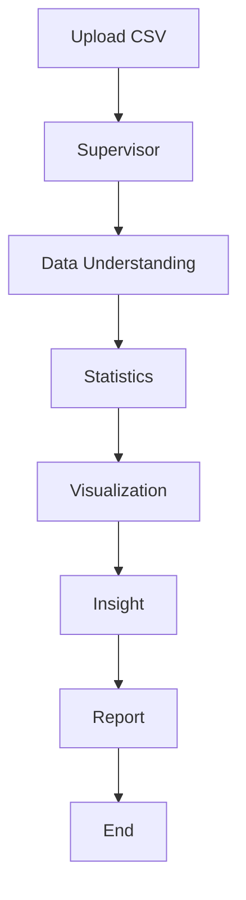
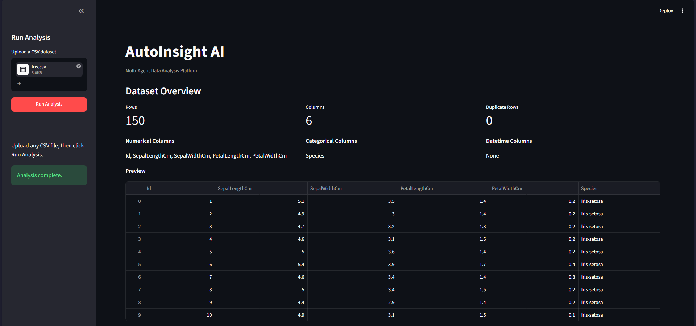
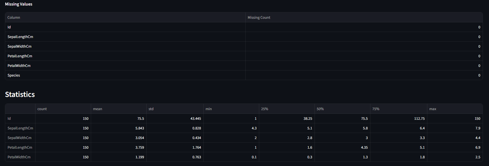
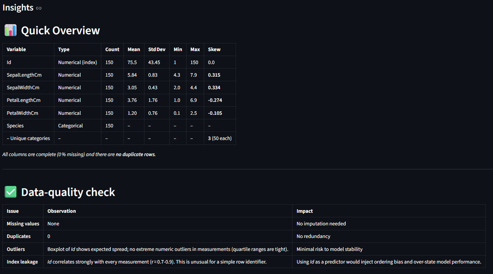
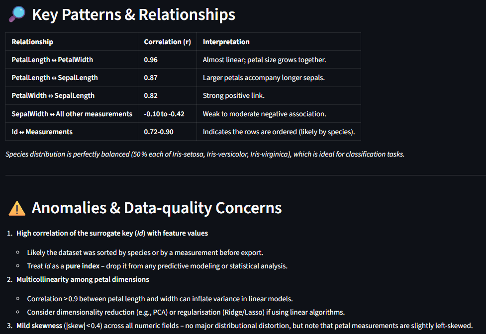
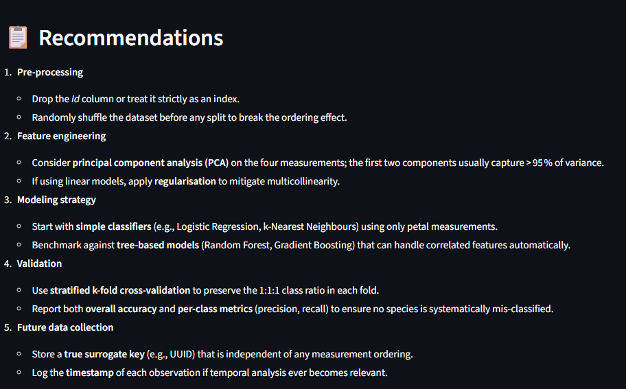
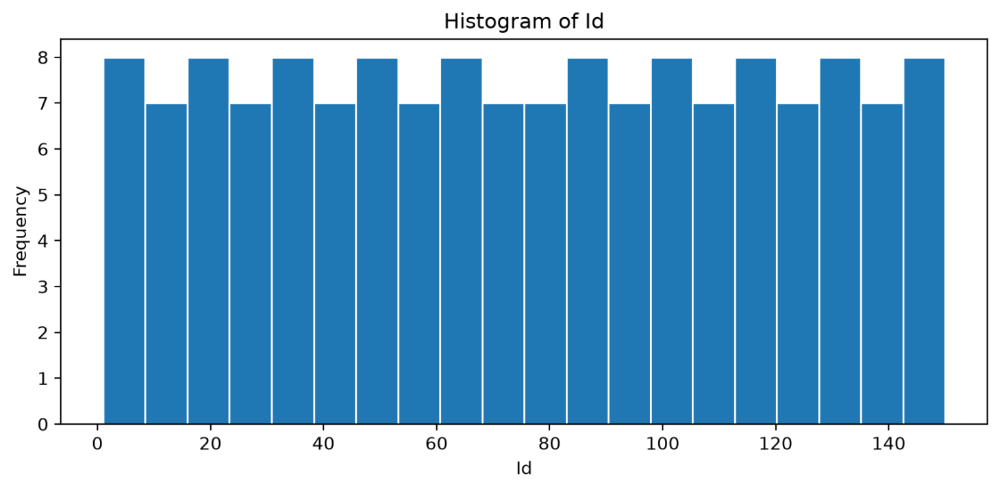
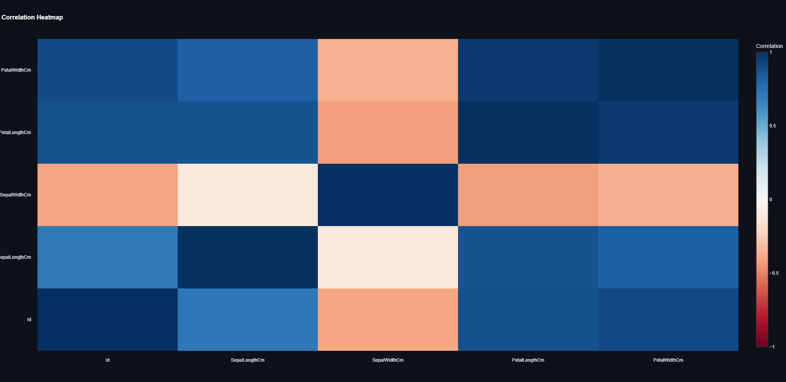
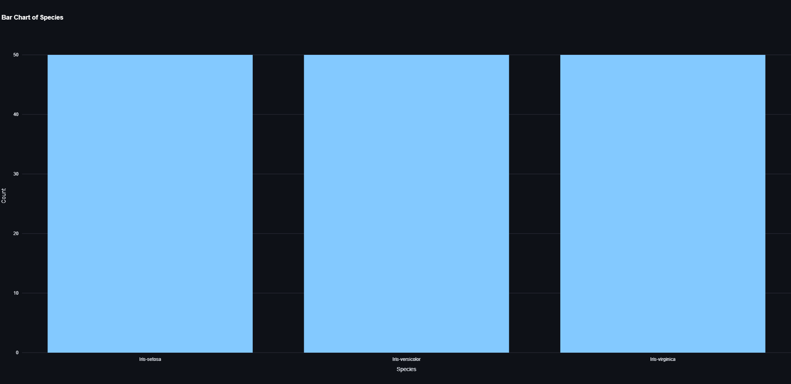
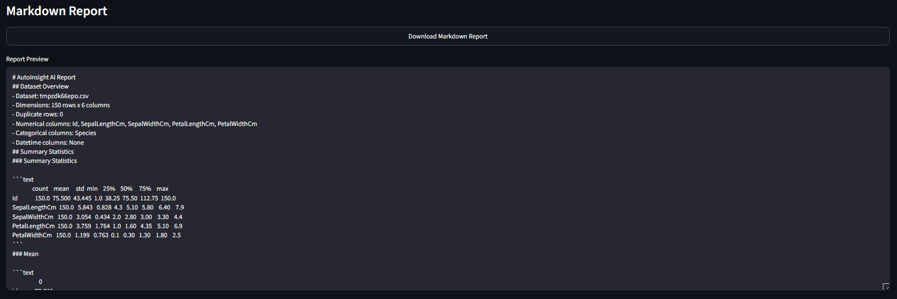

# AutoInsight AI

**Multi-Agent Data Analysis Platform**

AutoInsight AI is a compact, interview-ready CSV analysis app. A small LangGraph workflow coordinates specialized agents that understand the dataset, compute statistics in Python, generate practical visualizations, interpret the results with an LLM, and assemble a professional Markdown report.

The project is intentionally small so it can be explained confidently in 15 to 20 minutes.

## Project Overview

Users upload a CSV file in Streamlit, then the workflow runs end to end:

Upload CSV -> Supervisor -> Data Understanding -> Statistics -> Visualization -> Insight -> Report -> End

## Architecture Diagram


## Workflow Diagram



## Tech Stack

- Python
- LangGraph
- LangChain
- Groq
- Pandas
- Plotly
- Matplotlib
- Pydantic
- Streamlit

## Project Structure

```text
AutoInsight-AI/
├── app/
│   ├── agents/
│   │   ├── supervisor.py
│   │   ├── data_agent.py
│   │   ├── statistics_agent.py
│   │   ├── visualization_agent.py
│   │   ├── insight_agent.py
│   │   └── report_agent.py
│   ├── tools/
│   │   ├── dataframe.py
│   │   ├── statistics.py
│   │   └── plotting.py
│   ├── graph.py
│   ├── state.py
│   └── llm.py
├── frontend/
│   └── streamlit_app.py
├── report/
├── requirements.txt
└── README.md
```

## Installation

1. Create and activate a virtual environment.
2. Install the dependencies:

```bash
pip install -r requirements.txt
```

3. Set your Groq API key:

```bash
set GROQ_API_KEY=your_key_here
```

On PowerShell:

```powershell
$env:GROQ_API_KEY = "your_key_here"
```

## How to Run

Start the Streamlit app from the project root:

```bash
streamlit run frontend/streamlit_app.py
```

Upload a CSV file, click **Run Analysis**, and review the overview, statistics, visualizations, insights, and downloadable Markdown report.

## Screenshots

### Dashboard



### Statistics



### Insight 1



### Insight 2



### Insight 3



### Visualization 1



### Visualization 2



### Visualization 3



### Generated Report



## Sample Generated Report

The AI-generated report can be downloaded directly from the application. A sample generated report is available here:

📄 [View Sample Markdown Report](report/sample_report.md)

---

## Notes

- Statistics are computed in Python only.
- The LLM is used only for interpretation.
- Invalid plots are skipped instead of crashing the workflow.

## Future Improvements

- Add optional caching for repeated analyses.
- Add support for XLSX files.
- Add time-series specific visualizations when datetime columns are present.
- Save rendered reports automatically into the `reports/` folder.
- Add test coverage for the data, statistics, and plotting tools.

---

## Author

**Apurva Mishra**  
IMSc Quantitative Economics & Data Science  
Birla Institute of Technology, Mesra  

**GitHub:** https://github.com/apooorv19  
**LinkedIn:** https://www.linkedin.com/in/apooorv/

---

## Credits

### Iris Dataset

```text
Fisher, R. A. (1936).
The use of multiple measurements in taxonomic problems.
Annals of Eugenics, 7(2), 179–188.

Dataset available from the UCI Machine Learning Repository:
https://archive.ics.uci.edu/ml/datasets/iris
```
